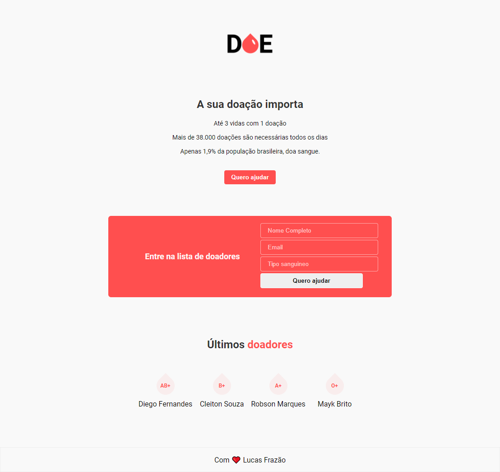

<h1 align="center">
  
</h1>

 <strong>Doe Sangue</strong> é uma página web desenvolvida com objetivo de facilitar e captar voluntários para doação de sangue. 

 Você pode visualizar a página na imagem abaixo ou clicando <strong> <a href="https://projeto-doe-sangue.netlify.app/" title="doe-sangue">aqui.</strong> 

<h1 align="center">
  
</h1> 

---
## 🚀 Tecnologias
* HTML
* CSS

## 🤔 Como contribuir
Se quiser contribuir com esse projeto, seja corrigindo problemas, adicionando comentários ou melhorando a documentação, você pode seguir os passos abaixo:
* Faça [um fork](https://help.github.com/pt/github/getting-started-with-github/fork-a-repo) desse repositório;
* Crie uma nova branch com as suas alterações: `git checkout -b my-feature`
* Salve as alterações e crie uma mensagem de commit contando o que você fez: `git commit -m "feature: My new feature"`
* Envie as suas alterações: `git push origin my-feature`

## 📝 Licença
Este projeto está sob a licença MIT.

Feito por [Lucas Frazão](https://www.linkedin.com/in/lucas-fraz%C3%A3o/) 👋🏻.
